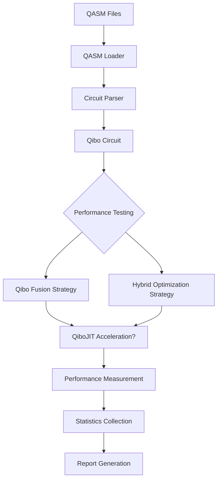

# QASM Performance Testing Framework Design

## Architecture Overview



## Circuit Categories

Based on the 14 QASM files, we have several algorithm categories:

1. **Benchmark Circuits**
   - Bell state preparation
   - Basis change circuits

2. **Quantum Algorithms**
   - Shor's algorithm (shor_n5)
   - Grover's algorithm (bv_n14)
   - Quantum Phase Estimation (qpe_n9)
   - HHL algorithm (hhl_n7)

3. **Variational Algorithms**
   - VQE/UCCSD (vqe_uccsd_n4)
   - QAOA (qaoa_n6)
   - DNN circuit (dnn_n8)

4. **Error Correction**
   - Error correction circuit (error_correctiond3_n5)

5. **Application Specific**
   - Quantum Fourier Transform (qf21_n15)
   - Ising model (ising_n10)
   - Big adder circuit (bigadder_n18)
   - BB84 protocol (bb84_n8)

## Performance Testing Strategies

### Strategy 1: Qibo Fusion Only
```python
# Load QASM
circuit = load_qasm_to_qibo("bell_n4_transpiled.qasm")

# Apply Qibo fusion
fused_circuit = circuit.fuse()

# Measure execution time
start_time = time.perf_counter()
result = fused_circuit()
execution_time = time.perf_counter() - start_time
```

### Strategy 2: Hybrid Optimization
```python
# Load QASM
circuit = load_qasm_to_qibo("bell_n4_transpiled.qasm")

# Apply hybrid optimization
optimized_circuit = optimize_qibo_circuit_hybrid(circuit, return_stats=True)

# Measure execution time
start_time = time.perf_counter()
result = optimized_circuit.execute()
execution_time = time.perf_counter() - start_time
```

## QiboJIT Integration

### Acceleration Criteria
- Circuit size > 15 qubits
- Circuit depth > 50 layers
- Execution time > 1 second with regular Qibo

### JIT Implementation
```python
try:
    from qibojit import Circuit as JITCircuit
    # Convert Qibo circuit to JIT circuit
    jit_circuit = JITCircuit.from_qibo(circuit)
    # Execute with JIT acceleration
    result = jit_circuit()
except ImportError:
    # Fallback to regular Qibo
    result = circuit()
```

## Performance Metrics

### Execution Metrics
- Raw execution time
- Memory usage
- Compilation time (for hybrid strategy)

### Optimization Metrics
- Gate count reduction
- Circuit depth reduction
- Compilation overhead

### Statistical Analysis
- Mean performance across runs
- Standard deviation
- Confidence intervals

## Expected Challenges

1. **QASM Parsing Complexity**
   - Different QASM versions and dialects
   - Unsupported gates or operations
   - Measurement and classical operations

2. **Performance Variability**
   - Hardware-specific optimizations
   - JIT compilation overhead
   - Circuit size scaling issues

3. **Benchmark Consistency**
   - Ensuring fair comparison
   - Multiple execution runs for statistical significance
   - Handling outlier measurements

## Report Structure

### Per-Circuit Analysis
```
Circuit: bell_n4_transpiled.qasm
- Qubits: 4
- Gates: 25
- Algorithm: Bell state preparation
- Qibo Fusion Time: 0.003s ± 0.001s
- Hybrid Optimization Time: 0.015s ± 0.002s (including compilation)
- Speedup: 1.8x
```

### Aggregate Analysis
- Performance by circuit category
- Scaling behavior analysis
- Best/worst performing circuits
- Recommendations for different circuit types